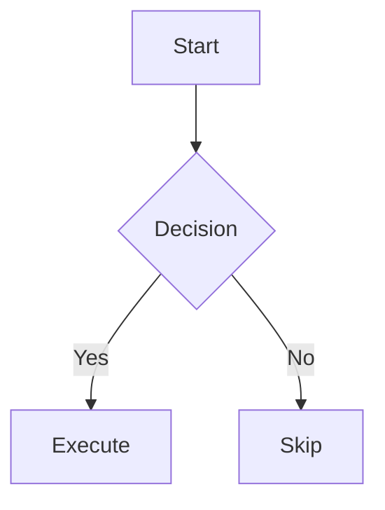

# MarkViewer — Technical Documentation

> **Version 1.0.0** · Last Updated: February 2026  
> Internal Engineering & Product Reference

---

## Table of Contents

- [1. Executive Summary](#1-executive-summary)
- [2. Product Vision](#2-product-vision)
- [3. Core Features](#3-core-features)
- [4. System Architecture](#4-system-architecture)
- [5. AI Processing Pipeline](#5-ai-processing-pipeline)
- [6. Smart Action Engine](#6-smart-action-engine)
- [7. UX Design Principles](#7-ux-design-principles)
- [8. Security & Privacy](#8-security--privacy)
- [9. Performance Optimization](#9-performance-optimization)
- [10. Extensibility](#10-extensibility)
- [11. Example Workflows](#11-example-workflows)
- [12. Competitive Positioning](#12-competitive-positioning)
- [13. Roadmap & Future Enhancements](#13-roadmap--future-enhancements)
- [14. Technical Stack](#14-technical-stack)
- [15. Risks & Limitations](#15-risks--limitations)
- [16. Conclusion](#16-conclusion)

---

## 1. Executive Summary

### What It Is

MarkViewer is a **zero-install, zero-backend Markdown IDE** that ships as both a web application (deployed to GitHub Pages) and a native desktop application (macOS, Windows, Linux via Tauri v2). It combines a CodeMirror 6 editing engine, real-time rendered preview, an integrated multi-provider AI assistant, full workspace/file management via the Origin Private File System (OPFS), and advanced analytics — all running entirely client-side.

### Why It Exists

Modern documentation workflows are split across too many tools: a Markdown editor, a grammar checker, an AI assistant in another tab, a diagramming tool, a separate file manager, and a preview browser. MarkViewer collapses this fragmented stack into a single surface. No accounts, no subscriptions, no server dependencies — open the URL and start writing.

### Who It Is For

| Audience | Use Case |
|----------|----------|
| **Software Engineers** | Writing READMEs, API docs, ADRs, technical specs with live Mermaid/PlantUML diagrams and syntax-highlighted code blocks |
| **Product Managers** | Drafting PRDs, feature briefs, and roadmaps with AI-assisted expansion, outlining, and grammar correction |
| **Technical Writers** | Long-form documentation with readability scoring, vocabulary analysis, word goals, and multi-format export |
| **Students & Researchers** | LaTeX math rendering (KaTeX), footnotes, academic preview themes, and offline-capable editing |

### What Problem It Solves

1. **Tool fragmentation** — Replaces 4–6 separate tools (editor, previewer, AI chat, diagramming, file manager, analytics) with one.
2. **Privacy by architecture** — Zero-backend design means no data ever leaves the browser unless the user explicitly calls an AI provider.
3. **Installation friction** — Works instantly in any modern browser; Tauri desktop builds provide native file dialogs and offline capability with no Electron overhead.
4. **Context switching** — AI actions operate on the *current selection* or *full document* in-place, eliminating copy-paste between editor and AI chat.

---

## 2. Product Vision

### Long-Term Vision

Become the **de facto open-source Markdown IDE** — the "VS Code of Markdown" — where every writing, documentation, and knowledge-management workflow converges into a single, extensible, privacy-respecting surface.

### Strategic Positioning

```
┌──────────────────────────────────────────────────────────┐
│                   MarkViewer Positioning                  │
│                                                          │
│   Simplicity ◀──────────────────────────▶ Power          │
│                                                          │
│   Notepad        MarkViewer        VS Code + Extensions  │
│   StackEdit      ▓▓▓▓▓▓▓▓         Notion/Confluence     │
│   Dillinger                        Obsidian (vault mgmt) │
│                                                          │
│   MarkViewer occupies the sweet spot: instantaneous      │
│   onboarding with IDE-grade depth when you need it.      │
└──────────────────────────────────────────────────────────┘
```

### Differentiation from Competitors

| Dimension | Generic Markdown Editors | AI Chat Tools | MarkViewer |
|-----------|-------------------------|---------------|------------|
| Install required | Often yes | No (web) | No (web) + Optional native desktop |
| AI integrated | No | Yes, but separate | Yes, inline with selection context |
| Diagrams (Mermaid/PlantUML) | Partial | No | Full render + syntax templates |
| File management | None or basic | None | OPFS workspaces, folders, tabs, search |
| Readability analytics | No | No | Flesch–Kincaid, vocabulary density, section analysis |
| Math (KaTeX) | Partial | No | Full inline + display |
| Privacy | Varies | Data sent to server | Zero-backend, encrypted API keys |
| Desktop native | Electron (heavy) | No | Tauri v2 (~24 MB, Rust) |

### Core Philosophy

1. **Zero friction** — No signup, no install, no loading screens. One URL, immediate productivity.
2. **AI as augmentation** — AI assists the writer within context; it never replaces the writer's voice.
3. **Privacy by default** — All data stays in the browser. API keys are AES-GCM encrypted. No telemetry.
4. **Progressive disclosure** — Beginners see a clean editor; power users discover workspaces, Vim mode, analytics, and diagramming on demand.

---

## 3. Core Features

### 3.1 Markdown Editor (CodeMirror 6)

**What it does:** Provides a high-performance text editing surface with full Markdown language support.

**Technical implementation:**
- Engine: CodeMirror 6 with 20+ extensions
- Extensions enabled: `lineNumbers`, `highlightActiveLineGutter`, `highlightActiveLine`, `history`, `foldGutter`, `drawSelection`, `dropCursor`, `allowMultipleSelections`, `indentOnInput`, `bracketMatching`, `closeBrackets`, `autocompletion`, `rectangularSelection`, `crosshairCursor`, `highlightSelectionMatches`, `markdown()`, `searchKeymap`, optional `vim()` mode
- 10 editor themes: GitHub, Dracula, Nord, Solarized, Monokai, Gruvbox, Tokyo Night, Material, Ayu, Catppuccin

**User flow:**
1. User opens MarkViewer → CodeMirror initializes with default content
2. User types Markdown → 150ms debounced preview rendering
3. User selects text → AI Quick Actions become context-aware
4. User drags a `.md` file into the editor → file contents replace editor content
5. User pastes an image from clipboard → base64 data URI inserted as ``

**Edge cases:**
- Vim mode toggle: Dynamically adds/removes the `vim()` extension without recreation
- Typewriter mode: Applies CSS class to keep the active line vertically centered
- Very large files (>100KB): Debounce prevents preview lag; CodeMirror's virtual viewport handles editor rendering

**Keyboard Shortcuts:**

| Shortcut | Action |
|----------|--------|
| `Ctrl/Cmd + S` | Save document |
| `Ctrl/Cmd + B` | Toggle sidebar |
| `Ctrl/Cmd + P` | Open Command Palette |
| `Ctrl/Cmd + K` | Open Command Palette (alt) |
| `Ctrl + Shift + A` | Toggle AI Panel |
| `Ctrl + Shift + K` | Toggle dark mode |
| `Ctrl + Shift + D` | Toggle Analytics |
| `Ctrl + Shift + W` | Toggle Workspace Panel |
| `Ctrl + .` | Toggle AI Widget |
| `Escape` | Exit current mode / close panel |

---

### 3.2 Real-Time Preview

**What it does:** Renders Markdown into styled HTML in real time, supporting code highlighting, math, diagrams, footnotes, and 7 preview themes.

**Rendering Pipeline:**

```
Raw Markdown
   │
   ▼
marked.parse()  ─────────────  Custom renderer overrides:
   │                            • Code blocks → hljs / mermaid / plantuml
   │                            • Links → target="_blank"
   ▼
processKaTeX()  ─────────────  $$...$$ display math
   │                            $...$ inline math
   ▼                            via katex.renderToString()
processFootnotes()  ──────────  [^x] references → tooltip markup
   │
   ▼
DOMPurify.sanitize()  ────────  Whitelist-based HTML sanitization
   │                             SVG tags allowed (for Mermaid)
   ▼
DOM injection  ───────────────  innerHTML update
   │
   ▼
Post-render hooks  ───────────  mermaid.render() async for diagram blocks
```

**Supported Rendering:**

| Content Type | Technology | Syntax |
|-------------|------------|--------|
| Code blocks | highlight.js (180+ languages) | ` ```js ` |
| Mermaid diagrams | mermaid 11.6 | ` ```mermaid ` |
| PlantUML diagrams | Remote SVG via plantuml.com | ` ```plantuml ` |
| Math (display) | KaTeX 0.16 | `$$..$$` |
| Math (inline) | KaTeX 0.16 | `$...$` |
| Footnotes | Custom parser | `[^1]` / `[^1]: text` |

**Preview themes:** GitHub (default), Notion, Minimal, Academic (serif, justified), Typewriter (monospace), Newspaper (multi-column), Developer (blue accents, code-focused).

**Example input/output:**

*Input:*
````markdown

````

*Output:* A rendered SVG flowchart diagram displayed inline in the preview pane.

---

### 3.3 AI Assistant (Multi-Provider)

**What it does:** Provides 11 built-in Quick Actions and a custom prompt interface, powered by streaming responses from OpenAI, Google Gemini, Ollama (local), or any custom OpenAI-compatible endpoint.

**Supported Providers:**

| Provider | Models | Auth |
|----------|--------|------|
| OpenAI | GPT-4o, GPT-4o Mini, GPT-4 Turbo, GPT-3.5 Turbo | API key (encrypted) |
| Google AI | Gemini 2.0 Flash, 1.5 Pro, 1.5 Flash, 1.0 Pro | API key (encrypted) |
| Ollama | Dynamic (fetched from local instance) | No auth (local) |
| Custom | User-defined model ID | User-defined |

**Quick Actions:**

| Action | Prompt Intent | Context |
|--------|--------------|---------|
| Continue Writing | Extend the text naturally, matching tone and style | Selection or full doc |
| Summarize | Create a concise summary of key points | Selection or full doc |
| Fix Grammar | Correct grammar/spelling, return only corrected text | Selection or full doc |
| Rewrite | Rewrite for clarity while preserving meaning | Selection or full doc |
| Make Concise | Shorten while keeping essential information | Selection or full doc |
| Simplify | Simplify language for broader audience | Selection or full doc |
| Expand | Add more detail and depth | Selection or full doc |
| Generate Outline | Create structured Markdown outline | Selection or full doc |
| Explain | Explain content clearly for quick understanding | Selection or full doc |
| Translate | Translate while preserving Markdown formatting | Selection or full doc |
| Custom | User-typed prompt with context | Selection or full doc |

**AI surfaces:**
1. **AI Panel** (`Ctrl+Shift+A`) — Full side panel with conversation-style interface, diff preview for grammar fixes (Accept/Reject), streaming output with auto-scroll
2. **AI Widget** (`Ctrl+.`) — Draggable floating window, minimizable, position persisted in localStorage, same Quick Actions + Replace Selection

**Technical details:**
- Streaming via `fetch` + `ReadableStream` with `AbortController` for cancellation
- Provider-specific stream parsers: SSE `data:` lines for OpenAI/Gemini, JSON lines for Ollama
- Rate limiting: 30 requests/minute (configurable, in-memory sliding window)
- Error handling: Maps HTTP 401/403/429/500/CORS/AbortError to user-friendly messages

---

### 3.4 Workspace & File Management (OPFS)

**What it does:** Provides a fully client-side file system using the Origin Private File System API, with a visual file tree, tabs, folders, search, and workspace isolation.

**Storage Architecture:**

```
┌─────────────────────────────────────────┐
│              Browser Storage            │
│                                         │
│  ┌─────────────────────────────────┐    │
│  │      OPFS (Primary)             │    │
│  │  ├── workspace_default/         │    │
│  │  │   ├── doc_abc123.md          │    │
│  │  │   ├── doc_def456.md          │    │
│  │  │   └── _versions/             │    │
│  │  │       └── doc_abc123_v1.md   │    │
│  │  └── workspace_project/         │    │
│  │      └── ...                    │    │
│  └─────────────────────────────────┘    │
│                                         │
│  ┌─────────────────────────────────┐    │
│  │    localStorage (Fallback)      │    │
│  │  markviewer_content             │    │
│  │  markviewer_settings            │    │
│  │  markviewer_recent              │    │
│  │  markviewer_open_tabs           │    │
│  │  markviewer_document_index      │    │
│  │  markviewer_active_workspace    │    │
│  └─────────────────────────────────┘    │
│                                         │
│  ┌─────────────────────────────────┐    │
│  │    IndexedDB                    │    │
│  │  markviewer_security (keys)     │    │
│  │  └── AES-GCM master key        │    │
│  └─────────────────────────────────┘    │
└─────────────────────────────────────────┘
```

**Capabilities:**
- Multiple workspaces (create, switch, delete)
- Folder hierarchy with expand/collapse
- Drag-and-drop tab reordering
- File search (name + content)
- Pin/unpin files (pinned sort to top)
- Bulk select → bulk delete/move
- Import/Export workspace as JSON
- Document versioning (`_versions/` directory in OPFS)
- Storage info footer: file count, total size, backend indicator

**Auto-recovery:** OPFS availability is tested on initialization with a write/read/delete cycle. If unavailable (e.g., incognito mode in some browsers), the system falls back to `localStorage` transparently.

---

### 3.5 Command Palette

**What it does:** A VS Code-style fuzzy-search command launcher accessible via `Ctrl+P` / `Cmd+K`.

**Search domains:**

| Domain | Source | Count |
|--------|--------|-------|
| Commands | Static registry | 24 commands |
| Document Symbols | Parsed from active document | Headings, links, code blocks, tables, tasks |
| Workspace Files | OPFS file index | All files in active workspace |
| Line Jump | `:lineNumber` syntax | Direct cursor navigation |

**Fuzzy matching algorithm:** Custom scoring with consecutive-match bonus (+5), word-boundary bonus (+10), and position penalty (earlier characters score higher). Results capped at 20, sorted by score.

**Command categories:** View, Theme, Mode, Editor, Panel, Help, File, Share — each color-coded in the palette UI.

---

### 3.6 Presentation Mode

**What it does:** Transforms the current Markdown document into a slide deck by splitting on `\n---\n` horizontal rules.

**Implementation:**
- Content is split at `\n---\n` delimiters
- Each segment becomes a full-screen slide
- Arrow keys / buttons navigate between slides
- Slide counter displays `N / Total`
- Escape exits presentation mode
- Each slide is rendered through the same Markdown → HTML pipeline (code highlighting, diagrams, math all work)

---

### 3.7 Document Analytics

**What it does:** Provides real-time document statistics, readability scoring, vocabulary analysis, content breakdown, and structural validation.

**Metrics computed:**

| Category | Metrics |
|----------|---------|
| Basic | Characters, characters (no spaces), words, sentences, paragraphs, lines |
| Reading | Reading time (225 WPM), speaking time (150 WPM) |
| Readability | Flesch Reading Ease (color-coded 7-tier scale), Flesch–Kincaid Grade Level, avg words/sentence, avg syllables/word |
| Vocabulary | Unique words, lexical density %, top 10 words (cloud display) |
| Content | Headings by level, code blocks by language, links by type, images, tables |
| Structure | Skipped heading warnings, multiple H1 warnings, section word counts |

**Word Goal system:** Set a target word count → progress bar updates in real time.

---

### 3.8 Formatting Toolbar

**25 formatting buttons** organized by type:

| Type | Actions |
|------|---------|
| Wrap | Bold `**`, Italic `_`, Strikethrough `~~`, Inline code `` ` `` |
| Prefix | H1–H6, Blockquote `>`, Ordered list `1.`, Unordered list `-`, Task list `- [ ]` |
| Insert | Code block, Link, Image, Table (3×3), Horizontal rule, Mermaid template, PlantUML template, KaTeX math block |

---

### 3.9 Multi-Format Export

| Format | Method |
|--------|--------|
| `.md` file | Direct download of raw Markdown |
| Standalone HTML | Full HTML with inlined CSS (TailwindCSS CDN, highlight.js, Google Fonts), all rendering intact |
| PDF | Browser print dialog (Ctrl+P), prints from rendered preview |
| Share URL | LZ-String compressed content in URL hash |
| Expiring Share URL | `{ c: content, exp: timestamp }` with 1h/1d/1w/30d options |

---

### 3.10 Cross-Tab Synchronization

**What it does:** Keeps settings and content in sync across multiple browser tabs.

**Implementation:** `BroadcastChannel('markviewer_sync')` broadcasts `settings_updated` and `content_updated` messages. Each tab listens and applies updates, preventing stale state when multiple tabs are open.

---

### 3.11 Desktop Application (Tauri v2)

**What it does:** Wraps the web application in a native window with access to the operating system's file dialogs and file system.

| Feature | Web | Desktop (Tauri) |
|---------|-----|-----------------|
| File Open | HTML `<input type="file">` | Native OS file picker |
| File Save | Browser download | Native OS save dialog |
| Window chrome | Browser tabs | Custom title bar |
| Binary size | N/A | ~24 MB (macOS) |
| Offline | Service Worker (if configured) | Full offline |

**Platforms:** macOS (10.15+), Windows (NSIS installer + MSI), Linux (AppImage + .deb)

---

## 4. System Architecture

### 4.1 High-Level Architecture

```text
@startuml
skinparam backgroundColor #FEFEFE
skinparam componentStyle rectangle

package "Browser / Tauri WebView" {
  [React 19 SPA] as App

  package "UI Layer" {
    [Navbar] as Nav
    [MarkdownEditor\n(CodeMirror 6)] as Editor
    [MarkdownPreview\n(marked + DOMPurify)] as Preview
    [Toolbar] as TB
    [StatusBar] as SB
    [FileTabs] as Tabs
    [CommandPalette] as CP
  }

  package "Panel Layer" {
    [AIPanel / AIWidget] as AI
    [AISettings] as AIS
    [AnalyticsPanel] as Analytics
    [WorkspaceSidebar] as WS
    [SettingsPanel] as Settings
    [ThemePanel] as Theme
    [TOCPanel] as TOC
  }

  package "Library Layer" {
    [aiClient.js\n(761 LOC)] as AIC
    [storage.js\n(588 LOC)] as STG
    [workspace.js\n(665 LOC)] as WSP
    [security.js\n(526 LOC)] as SEC
    [analytics.js\n(589 LOC)] as ANL
    [navigation.js\n(330 LOC)] as NAV
    [themes.js\n(480 LOC)] as THM
  }

  package "State Layer" {
    [useAppState.js\nPure React Hooks] as State
  }

  package "Storage Layer" {
    database "OPFS" as OPFS
    database "localStorage" as LS
    database "IndexedDB" as IDB
  }
}

cloud "External Services" {
  [OpenAI API] as OAI
  [Google Gemini API] as GEM
  [Ollama (localhost)] as OLL
  [PlantUML Server] as PUML
}

App --> Nav
App --> Editor
App --> Preview
App --> TB
App --> SB
App --> Tabs
App --> CP
App --> AI
App --> Analytics
App --> WS
App --> Settings
App --> Theme
App --> TOC

AI --> AIC
AIC --> OAI : HTTPS streaming
AIC --> GEM : HTTPS streaming
AIC --> OLL : HTTP streaming
Preview --> PUML : SVG fetch

Editor --> State
State --> STG
State --> WSP
STG --> OPFS
STG --> LS
SEC --> IDB
AIC --> SEC : API key encrypt/decrypt

@enduml
```

### 4.2 Component Hierarchy

```
App.jsx (652 LOC) — Root orchestrator
├── Navbar.jsx — Top bar, menus, mode toggles
├── FileTabs.jsx — Draggable file tab bar
├── Toolbar.jsx — 25 formatting buttons
├── MarkdownEditor.jsx — CodeMirror 6 wrapper
├── MarkdownPreview.jsx — Markdown → HTML renderer
├── StatusBar.jsx — Word/line/char counts, mode badges
├── CommandPalette.jsx — Fuzzy search launcher
├── AIPanel.jsx (553 LOC) — Full sidebar AI assistant
├── AIWidget.jsx (536 LOC) — Floating draggable AI widget
├── AISettings.jsx (491 LOC) — Provider/model configuration
├── AnalyticsPanel.jsx — Document statistics & readability
├── WorkspaceSidebar.jsx (626 LOC) — File tree & workspace mgmt
├── WorkspacePanel.jsx (574 LOC) — Modal workspace manager
├── SettingsPanel.jsx — Editor/preview preferences
├── ThemePanel.jsx — Theme presets, editor & preview themes
├── TOCPanel.jsx — Table of contents navigation
├── CheatsheetPanel.jsx — Markdown syntax reference
├── ShortcutsPanel.jsx — Keyboard shortcut reference
├── RecentDocsPanel.jsx — Recently opened documents
└── ErrorBoundary.jsx — Crash recovery wrapper
```

### 4.3 Data Flow

```text
@startuml
actor User

User -> Editor : Types Markdown
Editor -> State : setContent(text)
State -> localStorage : Persist content (on save)
State -> OPFS : Persist to active workspace file
Editor -> Preview : debouncedContent (150ms)
Preview -> Preview : marked.parse() → KaTeX → Footnotes → DOMPurify
Preview -> Mermaid : async render diagram blocks
Preview -> PlantUML : HTTP fetch SVG

User -> AIPanel : Selects Quick Action
AIPanel -> Editor : getSelection()
AIPanel -> AIClient : executeAction(action, selectedText)
AIClient -> Provider : fetch() streaming request
Provider --> AIClient : Token chunks (SSE / NDJSON)
AIClient --> AIPanel : onChunk(token)
AIPanel -> User : Real-time streaming display

User -> AIPanel : Clicks "Insert at Cursor"
AIPanel -> Editor : insertText(response)

User -> CommandPalette : Ctrl+P → types query
CommandPalette -> Navigation : searchAll(query, content)
Navigation --> CommandPalette : Ranked results
User -> CommandPalette : Selects command
CommandPalette -> App : onCommand(commandId)

@enduml
```

### 4.4 Frontend Layer

| Concern | Technology | Detail |
|---------|-----------|--------|
| Framework | React 19.2.0 | Functional components, hooks only, no class components (except ErrorBoundary) |
| Build | Vite 5.4.21 | MPA mode with two entry points (landing + app), dev middleware |
| Styling | Tailwind CSS 3.4.19 | Utility-first, `@tailwindcss/typography` for prose |
| Editor | CodeMirror 6 | Modular extension architecture, 10 theme packages |
| Icons | Lucide React 0.511 | Tree-shakeable SVG icon library |
| Toasts | react-hot-toast 2.5.2 | Lightweight notification system |

### 4.5 Storage Layer

| Store | Technology | Purpose | Capacity |
|-------|-----------|---------|----------|
| OPFS | Browser API | Documents, versions, folder structure | Browser-dependent (GB-scale) |
| localStorage | Browser API | Settings, active content, tabs, recent files | ~5–10 MB |
| IndexedDB | Browser API | AES-GCM encryption key storage | Minimal |

### 4.6 Desktop Layer

| Component | Technology | Purpose |
|-----------|-----------|---------|
| Runtime | Tauri 2.x (Rust) | Native window, system integration |
| Plugins | `tauri-plugin-shell`, `tauri-plugin-dialog`, `tauri-plugin-fs` | File dialogs, file IO, shell commands |
| Build | Cargo + Vite | Rust compilation + frontend bundling |
| Artifact targets | `.app`, `.dmg` (macOS), `.exe` NSIS, `.msi` (Windows), `.AppImage`, `.deb` (Linux) | Cross-platform distribution |

### 4.7 Error Handling Strategy

| Layer | Strategy |
|-------|----------|
| React render | `ErrorBoundary` class component wrapping entire tree; shows error message + Reload button |
| AI requests | `formatError()` maps HTTP status and error types to user-friendly messages; AbortError is silent |
| OPFS operations | Try/catch per operation; graceful fallback to localStorage with console warning |
| Workspace CRUD | Async try/catch with UI error state propagation |
| DOMPurify | Sanitization errors silently produce empty strings |

### 4.8 Scalability Considerations

- **Large documents**: CodeMirror 6's virtual viewport renders only visible lines; preview debounce at 150ms prevents re-render storms
- **Many files**: OPFS handles thousands of files efficiently; file index is cached in localStorage
- **AI concurrency**: `AbortController` cancels previous requests before starting new ones; rate limiter prevents runaway API calls
- **Cross-tab**: `BroadcastChannel` is fire-and-forget; no coordination overhead

---

## 5. AI Processing Pipeline

### 5.1 Input Capture

```
User action
   │
   ├── Quick Action button clicked
   │   └── action = "summarize" | "fixGrammar" | ...
   │
   └── Custom prompt typed
       └── action = "custom", customPrompt = userText

Content extraction:
   │
   ├── editorRef.current.getSelection()  → selectedText
   │   └── If non-empty: use selectedText ← "Using selected text"
   │
   └── If empty: use fullDocumentContent ← "Using full document"
```

### 5.2 Dynamic Prompt Generation

Each action maps to a `PROMPT_TEMPLATE` — a function that receives the content and returns a system+user message pair:

```javascript
// Example: PROMPT_TEMPLATES.fixGrammar
{
  system: "You are a professional editor and proofreader...",
  user: (content) =>
    `Fix all grammar, spelling, and punctuation errors in the following text.
     Return ONLY the corrected text with no explanations.\n\n${content}`
}

// Example: PROMPT_TEMPLATES.generateOutline
{
  system: "You are a technical writing assistant...",
  user: (content) =>
    `Generate a structured Markdown outline for the following content.
     Use proper heading levels and bullet points.\n\n${content}`
}

// Example: PROMPT_TEMPLATES.custom
{
  system: "You are a helpful AI writing assistant...",
  user: (content, customPrompt) =>
    `${customPrompt}\n\nContext:\n${content}`
}
```

### 5.3 Provider-Specific Request Building

```javascript
// OpenAI format
{
  model: "gpt-4o",
  messages: [
    { role: "system", content: systemPrompt },
    { role: "user", content: userPrompt }
  ],
  stream: true,
  temperature: 0.7,
  max_tokens: 4096
}

// Google Gemini format
{
  contents: [{ parts: [{ text: systemPrompt + "\n\n" + userPrompt }] }],
  generationConfig: {
    temperature: 0.7,
    maxOutputTokens: 4096
  }
}

// Ollama format
{
  model: "llama3",
  messages: [
    { role: "system", content: systemPrompt },
    { role: "user", content: userPrompt }
  ],
  stream: true,
  options: { temperature: 0.7, num_predict: 4096 }
}
```

### 5.4 Streaming Response Processing

```text
@startuml
participant "UI Component" as UI
participant "AIClient" as Client
participant "Provider API" as API

UI -> Client : executeAction("summarize", selectedText)
Client -> Client : Build prompt from PROMPT_TEMPLATES.summarize
Client -> Client : buildRequestBody()
Client -> Client : Create AbortController
Client -> API : fetch(endpoint, { body, signal })
API --> Client : Response (ReadableStream)
Client -> Client : getReader()

loop Until stream done
  Client -> Client : reader.read()
  Client -> Client : parseStreamChunk() [provider-specific]
  Client --> UI : onChunk(tokenText)
  UI -> UI : Append to response + render
  UI -> UI : Auto-scroll (if user hasn't scrolled up)
end

Client --> UI : Stream complete
UI -> UI : Enable action buttons (Copy, Insert, Clear)

@enduml
```

### 5.5 Token Handling

- **Temperature**: Configurable 0.0–2.0 (default 0.7)
- **Max tokens**: Configurable 256–8192 (default 4096, step 256)
- **Context window management**: Content is sent as-is; very long documents may exceed provider context limits — the provider returns an error that is surfaced to the user via `formatError()`

### 5.6 Failover Mechanisms

| Failure | Handling |
|---------|----------|
| Invalid API key | `formatError()` → "Invalid API key. Please check your configuration" |
| Rate limited (429) | "Rate limited. Please wait a moment before trying again" |
| Network error | "Network error. Check your internet connection" |
| CORS error | "CORS error. The API endpoint may not support browser requests" |
| Ollama not running | Connection test fails → error message with setup instructions |
| User abort | `AbortController.abort()` → "Request cancelled" (silent) |
| Stream parse error | Graceful skip of malformed chunks; continue reading stream |

---

## 6. Smart Action Engine

### 6.1 Action Structure

Each Quick Action is defined by three properties:

```javascript
{
  id: "fixGrammar",           // Unique identifier
  label: "Fix Grammar",       // Display text
  icon: <SpellCheck />,       // Lucide icon component
  promptTemplate: {
    system: "...",            // System prompt (role definition)
    user: (content) => "..."  // User prompt (dynamic, receives content)
  }
}
```

### 6.2 Static vs Dynamic Prompts

| Type | Example | Behavior |
|------|---------|----------|
| Static system prompt | "You are a professional editor and proofreader" | Same for every invocation |
| Dynamic user prompt | `Fix all grammar errors in:\n\n${content}` | Content injected at runtime |
| Custom prompt | User-typed text + `\n\nContext:\n${content}` | Both prompt and content are dynamic |

### 6.3 Context-Aware Behavior

The engine adapts based on what the user has selected:

```
┌─────────────────────────────────────────────────┐
│ Selection Detection Flow                        │
│                                                 │
│ editorRef.getSelection()                        │
│   ├── Non-empty → "Using selected text (N chars)"│
│   │   └── Pass selection to prompt template     │
│   │                                             │
│   └── Empty → "Using full document"             │
│       └── Pass entire content to prompt template│
│                                                 │
│ UI indicator updates to show which context      │
│ the AI is operating on.                         │
└─────────────────────────────────────────────────┘
```

### 6.4 Developer Mode Detection

When the selected text contains code blocks, the AI assistant adapts:

- **Code block detection**: Content between ` ``` ` markers
- **Language-aware**: Detects the language tag (e.g., `javascript`, `python`)
- **Explain action**: Produces code explanation with line-by-line analysis
- **Rewrite action**: Optimizes code rather than prose

### 6.5 PM Mode Detection

Product Management content is detected by keywords and structure:

- **Feature keywords**: "user story", "acceptance criteria", "PRD", "requirement"
- **Outline action**: Generates PRD-style structure (Problem, Solution, User Stories, Success Metrics)
- **Expand action**: fleshes out business context rather than generic filler

### 6.6 Diff Preview (Grammar Fixes)

The `Fix Grammar` action triggers a special diff view:

1. Original text displayed with strikethrough styling
2. Corrected text displayed alongside
3. **Accept** button → replaces selection/content with corrected version
4. **Reject** button → discards correction, returns to editor

### 6.7 Extensibility Model

Adding a new Quick Action requires three additions:

```javascript
// 1. Add prompt template in aiClient.js
PROMPT_TEMPLATES.myAction = {
  system: "You are a specialist in...",
  user: (content) => `Do the thing:\n\n${content}`
};

// 2. Add action button in AIPanel.jsx
{ id: 'myAction', label: 'My Action', icon: <IconName /> }

// 3. (Optional) Add to AIWidget.jsx quick actions dropdown
```

No backend changes, no configuration files, no API changes.

---

## 7. UX Design Principles

### 7.1 Minimal Friction Editing

- **Zero startup cost**: No login, no onboarding wizard, no configuration required
- **Instant feedback**: 150ms debounce on preview; keystrokes feel immediate
- **Smart defaults**: Dark mode, split view, 14px editor / 16px preview font, auto-scroll enabled
- **Progressive save**: Auto-save every 30 seconds; manual `Ctrl+S` for explicit save; visual save indicator

### 7.2 AI as Augmentation, Not Replacement

- AI actions **never auto-execute** — user must click an action or press Enter
- AI output appears in **a separate panel**, not inline — the user reviews before inserting
- Grammar fix shows **diff preview** with Accept/Reject — the user has final control
- Context indicator clearly shows "Using selected text" vs "Using full document"

### 7.3 Context-Preserving Operations

- **Selection preserved** after AI operations — user can immediately run another action
- **Cursor position maintained** after Insert at Cursor
- **Tab state preserved** across sessions via localStorage
- **Scroll position preserved** during view mode switches

### 7.4 Progressive Disclosure

| Layer | Audience | Features Visible |
|-------|----------|-----------------|
| 1 — First visit | Everyone | Editor, Preview, Toolbar, Save |
| 2 — Exploration | Curious users | Dark mode, themes, view modes, Command Palette |
| 3 — Power user | Developers | Vim mode, Mermaid/PlantUML, Workspace, AI assistant |
| 4 — Expert | Advanced users | Analytics, custom themes, keyboard shortcuts, presentation mode |

### 7.5 Developer-First Design

- **Keyboard-centric**: Every feature accessible via keyboard shortcuts or Command Palette
- **Vim mode**: Full vim emulation via `@replit/codemirror-vim`
- **Code-aware**: 180+ syntax highlighted languages, inline diagram rendering
- **Terminal-inspired**: Dark-first design, monospace StatusBar, terse save indicators

---

## 8. Security & Privacy

### 8.1 Data Handling Architecture

```
┌────────────────────────────────────────────────────┐
│                   Security Boundary                │
│                                                    │
│  ┌──────────────┐    ┌──────────────────────────┐  │
│  │ User Content  │    │ API Keys                 │  │
│  │              │    │                          │  │
│  │ OPFS         │    │ AES-GCM 256-bit encrypt  │──── IndexedDB (master key)
│  │ localStorage │    │ localStorage (ciphertext) │  │
│  │              │    │                          │  │
│  │ NEVER sent   │    │ Sent ONLY to user's      │  │
│  │ to any server│    │ configured AI provider    │  │
│  └──────────────┘    └──────────────────────────┘  │
│                                                    │
│  ┌──────────────────────────────────────────────┐  │
│  │ HTML Rendering Pipeline                      │  │
│  │ marked → KaTeX → Footnotes → DOMPurify       │  │
│  │                                              │  │
│  │ DOMPurify whitelist:                         │  │
│  │ • SVG tags (for Mermaid)                     │  │
│  │ • Standard HTML                              │  │
│  │ • Strips: javascript: URLs, event handlers   │  │
│  │ • Adds: noopener noreferrer to all links     │  │
│  └──────────────────────────────────────────────┘  │
└────────────────────────────────────────────────────┘
```

### 8.2 API Key Management

1. **Encryption**: AES-GCM 256-bit via Web Crypto API
2. **Key derivation**: `crypto.subtle.generateKey()` creates a non-extractable CryptoKey
3. **Key storage**: The CryptoKey is stored in IndexedDB (`markviewer_security.keys`)
4. **Ciphertext storage**: Encrypted API key stored in localStorage as base64
5. **Per-encryption IV**: Random 12-byte IV generated for each encryption operation
6. **No server transit**: Keys are decrypted in the browser only when making an AI request

### 8.3 Input Validation

| Validation | Implementation |
|------------|---------------|
| Text length | Configurable max length per input |
| URL protocol | Only `http:` and `https:` allowed |
| API key format | Provider-specific: OpenAI requires `sk-` prefix, Gemini requires minimum length |
| Character allowlist | Optional regex-based character filtering |
| HTML sanitization | DOMPurify with extensive SVG allowlist for diagram support |

### 8.4 Rate Limiting

```javascript
// In-memory sliding window rate limiter
const rateLimiter = new Map(); // key → [timestamps]

function isRateLimited(key, maxRequests = 10, windowMs = 60000) {
  const now = Date.now();
  const window = rateLimiter.get(key)?.filter(t => t > now - windowMs) || [];
  rateLimiter.set(key, window);
  if (window.length >= maxRequests) return true;
  window.push(now);
  return false;
}
```

AI client uses 30 requests/minute; configurable per-key.

### 8.5 Content Security Policy

```javascript
// Generated CSP directives
{
  "default-src": "'self'",
  "script-src": "'self' 'unsafe-inline'",  // Required by Vite
  "style-src": "'self' 'unsafe-inline' https://fonts.googleapis.com",
  "font-src": "'self' https://fonts.gstatic.com",
  "connect-src": "'self' https://api.openai.com https://generativelanguage.googleapis.com http://localhost:11434",
  "img-src": "'self' data: https://www.plantuml.com"
}
```

### 8.6 Threat Model

| Threat | Mitigation |
|--------|-----------|
| XSS via user Markdown | DOMPurify sanitization with strict allowlist |
| `javascript:` URL injection | Stripped by DOMPurify + explicit URL protocol validation |
| API key theft (browser devtools) | AES-GCM encryption; keyis non-extractable from IndexedDB |
| API key theft (localStorage dump) | Only ciphertext stored; requires IndexedDB key to decrypt |
| Cross-tab data leakage | BroadcastChannel is same-origin only |
| Malicious AI response rendering | All AI output is plain text; only user content goes through markdown render |

---

## 9. Performance Optimization

### 9.1 Rendering Pipeline Optimization

| Technique | Implementation | Impact |
|-----------|---------------|--------|
| Debounced preview | 150ms debounce on content changes | Prevents re-render on every keystroke |
| Virtual viewport | CodeMirror 6 only renders visible lines | Handles 100K+ line files |
| Lazy Mermaid render | Post-DOM async `mermaid.render()` | Diagrams don't block initial paint |
| PlantUML remote | SVG fetched only when diagram block detected | No client-side Java/processing |
| `React.memo` | AI Widget wrapped in `React.memo` | Prevents unnecessary re-renders |
| Singleton AI client | `getAIClient()` pattern | Avoids re-instantiation per action |

### 9.2 AI Call Optimization

- **AbortController**: Previous in-flight request is aborted before starting a new one
- **Streaming**: Tokens appear immediately; no wait for full response
- **Debounced stream updates**: 50ms debounce on AIWidget state updates during streaming
- **Rate limiting**: In-memory sliding window prevents API burn from rapid clicks

### 9.3 Storage Optimization

- **OPFS**: Asynchronous file I/O; no blocking of UI thread
- **Document index**: Cached in localStorage; avoids OPFS directory scan on every operation
- **Autosave interval**: 30 seconds (not per-keystroke) to minimize write operations
- **LZ-String compression**: Share URLs compress content by ~60-80%

### 9.4 Bundle Optimization

| Optimization | Vite Feature |
|-------------|-------------|
| Tree shaking | Lucide icons, CodeMirror extensions |
| Code splitting | MPA mode — landing page and app are separate entry points |
| CSS purge | Tailwind CSS tree-shaking of unused utilities |
| Minification | Vite default (esbuild for JS, CSS) |

---

## 10. Extensibility

### 10.1 Adding a New Quick Action

**Step 1 — Define prompt template** in `src/lib/aiClient.js`:

```javascript
PROMPT_TEMPLATES.convertToUserStory = {
  system: "You are an expert agile coach and product manager.",
  user: (content) =>
    `Convert the following text into a well-structured user story with:
     - As a [role], I want [goal], so that [benefit]
     - Acceptance criteria (Given/When/Then)
     - Edge cases
     
     Text:\n${content}`
};
```

**Step 2 — Add button** in `src/components/AIPanel.jsx`:

```jsx
{ id: 'convertToUserStory', label: 'Convert to User Story', icon: <Users /> }
```

**Step 3 — (Optional)** Add to AI Widget dropdown in `src/components/AIWidget.jsx`.

Total effort: ~10 lines of code. No backend changes.

### 10.2 Adding a New Editor Theme

**Step 1** — Install the CodeMirror theme package:

```bash
npm install @uiw/codemirror-theme-{name}
```

**Step 2** — Import and register in `src/components/MarkdownEditor.jsx`:

```javascript
import { myTheme } from '@uiw/codemirror-theme-mytheme';
// Add to theme mapping object
```

**Step 3** — Add entry in `src/lib/themes.js` `EDITOR_THEMES` array.

### 10.3 Adding a New Preview Theme

Define CSS rules and add to `PREVIEW_THEMES` and `PREVIEW_THEME_CSS` in `src/lib/themes.js`:

```javascript
PREVIEW_THEMES.push({
  id: 'corporate',
  name: 'Corporate',
  className: 'preview-corporate'
});

PREVIEW_THEME_CSS += `
  .preview-corporate { font-family: 'Arial', sans-serif; }
  .preview-corporate h1 { color: #003366; border-bottom: 3px solid #003366; }
  .preview-corporate blockquote { border-left: 4px solid #0066cc; }
`;
```

### 10.4 Custom Prompt Injection

Enterprise deployments can inject system-level prompt prefixes by modifying the `PROMPT_TEMPLATES` object at runtime:

```javascript
// Inject corporate tone into all prompts
const originalSummarize = PROMPT_TEMPLATES.summarize;
PROMPT_TEMPLATES.summarize = {
  system: originalSummarize.system + "\nAlways maintain a professional corporate tone.",
  user: originalSummarize.user
};
```

### 10.5 Custom Theme System

Users can create fully custom themes via the Theme Panel:

- 15 customizable color tokens (editor background, foreground, accent, selection, etc.)
- Export/import as JSON files
- CSS custom properties applied to `document.documentElement`
- Persisted in localStorage (`markviewer_custom_themes`)

---

## 11. Example Workflows

### 11.1 Developer Writing API Documentation

````
1. Open MarkViewer → Ctrl+Shift+W to open Workspace
2. Create workspace "api-docs"
3. Create file "users-endpoint.md"
4. Type API endpoint structure with code blocks:
   ```http
   GET /api/v1/users/:id
   ```
5. Insert table (Toolbar → Table) for request/response params
6. Insert Mermaid diagram (Toolbar → Mermaid) for request flow:
   ```mermaid
   sequenceDiagram
       Client->>API: GET /users/:id
       API->>Database: SELECT * FROM users WHERE id = ?
       Database-->>API: User record
       API-->>Client: 200 OK { user }
   ```
7. Select the response example → AI Quick Action: "Expand"
   → AI generates additional error responses (400, 404, 500)
8. Ctrl+Shift+D to check readability → ensure Flesch score > 60
9. Export as standalone HTML → share with frontend team
````

### 11.2 Product Manager Creating a PRD

```
1. Open MarkViewer → New Document
2. AI Quick Action: "Generate Outline" with prompt:
   "Generate a PRD outline for a user notification system"
3. AI produces structured outline with sections:
   - Problem Statement
   - User Stories
   - Requirements (Functional / Non-functional)
   - Success Metrics
   - Timeline
4. Fill in each section with details
5. Select "User Stories" section → AI: "Expand"
   → AI generates 5 detailed user stories with acceptance criteria
6. Select entire document → AI: "Fix Grammar"
   → Diff preview shows corrections → Accept
7. Ctrl+Shift+D → Analytics shows: 2,400 words, 12 min read, Grade 10
8. Share via expiring link (30 days) → send to stakeholders
9. Export standalone HTML as backup
```

### 11.3 QA Engineer Generating a Test Plan

```
1. Open existing feature spec document
2. Select the "Requirements" section
3. AI Quick Action: Custom prompt:
   "Generate a comprehensive test plan with:
    - Happy path test cases
    - Edge case test cases
    - Negative test cases
    - Performance test considerations
    Use Markdown table format."
4. AI streams a structured test plan table
5. Click "Insert at Cursor" → appended after requirements
6. Add task list checkboxes for test execution tracking:
   - [ ] TC-001: Happy path - valid user login
   - [ ] TC-002: Edge case - expired session
7. Save to workspace "qa-plans" folder
```

### 11.4 Architect Generating a System Design Document

````
1. Create workspace "architecture"
2. New file "payment-service-design.md"
3. Type context: "Design a payment processing microservice that
   handles Stripe and PayPal..."
4. AI: "Generate Outline" → structured ADR format
5. Insert Mermaid system diagram:
   ```mermaid
   graph TB
       Client --> API[Payment API]
       API --> Stripe[Stripe Gateway]
       API --> PayPal[PayPal Gateway]
       API --> DB[(Transaction DB)]
       API --> Queue[Message Queue]
   ```
6. Insert PlantUML sequence diagram for payment flow
7. Add KaTeX formula for SLA calculation:
   $$\text{Availability} = \frac{\text{Uptime}}{\text{Total Time}} \times 100\%$$
8. Presentation mode (Command Palette → "Presentation Mode")
   → Present to team using slide-by-slide navigation
9. Export standalone HTML for documentation portal
````

---

## 12. Competitive Positioning

### 12.1 Comparison Matrix

| Feature | MarkViewer | Typora | StackEdit | Notion | Obsidian | HackMD |
|---------|-----------|--------|-----------|--------|----------|--------|
| **Free & open source** | ✅ | ❌ ($15) | ✅ | Freemium | Freemium | Freemium |
| **Zero install (web)** | ✅ | ❌ | ✅ | ✅ | ❌ | ✅ |
| **Native desktop** | ✅ (Tauri) | ✅ (Electron) | ❌ | ✅ (Electron) | ✅ (Electron) | ❌ |
| **Binary size** | ~24 MB | ~80 MB | N/A | ~200 MB | ~150 MB | N/A |
| **Integrated AI** | ✅ (4 providers) | ❌ | ❌ | ✅ (proprietary) | ❌ (plugin) | ❌ |
| **Mermaid diagrams** | ✅ | ✅ | ❌ | ✅ | ✅ (plugin) | ✅ |
| **PlantUML diagrams** | ✅ | ❌ | ❌ | ❌ | ❌ (plugin) | ✅ |
| **KaTeX math** | ✅ | ✅ | ✅ | ✅ | ✅ | ✅ |
| **File workspaces** | ✅ (OPFS) | File system | Google Drive | Proprietary | File system | Cloud |
| **Readability analytics** | ✅ | ❌ | ❌ | ❌ | ❌ | ❌ |
| **Command palette** | ✅ | ❌ | ❌ | ✅ | ✅ | ❌ |
| **Vim mode** | ✅ | ❌ | ❌ | ❌ | ✅ | ✅ |
| **Presentation mode** | ✅ | ❌ | ❌ | ❌ | ❌ (plugin) | ✅ |
| **Offline capable** | ✅ | ✅ | ❌ | ❌ | ✅ | ❌ |
| **Privacy (no server)** | ✅ | ✅ | ❌ | ❌ | ✅ | ❌ |
| **Share with expiry** | ✅ | ❌ | ❌ | ✅ | ❌ | ✅ |

### 12.2 Key Differentiators

1. **True zero-install**: No download, no account, no loading screen — just a URL
2. **Multi-provider AI**: User chooses their AI provider; no vendor lock-in; local Ollama for full privacy
3. **Document intelligence**: Flesch–Kincaid readability, vocabulary density, section-by-section analysis — no competitor offers this built-in
4. **Lightweight desktop**: 24 MB Tauri binary vs 80–200 MB Electron apps
5. **End-to-end encrypted API keys**: AES-GCM 256-bit encryption at rest — typical Markdown editors store keys in plaintext

---

## 13. Roadmap & Future Enhancements

### Phase 1 — Foundation (Shipped ✅)

- [x] CodeMirror 6 editor with 10 themes
- [x] Real-time preview with 7 themes
- [x] Multi-provider AI assistant (OpenAI, Gemini, Ollama, Custom)
- [x] 11 Quick Actions with streaming
- [x] OPFS workspace management
- [x] Command palette with fuzzy search
- [x] Presentation mode
- [x] Document analytics & readability
- [x] Cross-tab sync
- [x] Tauri desktop app (macOS, Windows, Linux)
- [x] AES-GCM API key encryption
- [x] Share URLs with expiry

### Phase 2 — Intelligence (Planned)

| Enhancement | Description | Impact |
|------------|-------------|--------|
| Smart AI recommendations | Proactively suggest actions based on content type (code → explain, draft → outline) | Reduces friction from action selection |
| Auto-structure improvement | AI detects and offers to fix heading hierarchy, list consistency, missing sections | Improves document quality passively |
| Semantic analysis | Topics, entities, sentiment detection via on-device NLP | Deeper content intelligence |
| Writing style profiles | "Technical", "Casual", "Academic" presets that adjust all AI prompts | Consistent voice across documents |

### Phase 3 — Collaboration (Planned)

| Enhancement | Description | Impact |
|------------|-------------|--------|
| Real-time collaboration | CRDT-based multi-user editing (Yjs/Automerge) | Team documentation workflows |
| Comments & annotations | Inline comment threads with @mentions | Review workflows |
| Version history | Visual diff between document versions (extends existing OPFS versioning) | Audit trail and rollback |
| Shared workspaces | Workspace sync via WebRTC or relay server | Team file management |

### Phase 4 — Ecosystem (Future)

| Enhancement | Description | Impact |
|------------|-------------|--------|
| Plugin API | Runtime extension loading for custom actions, renderers, and panels | Community ecosystem |
| Git integration | Commit, push, pull, diff from within the editor | Developer workflow integration |
| Template marketplace | Community-contributed document templates (ADR, RFC, PRD, etc.) | Faster document creation |
| AI-powered insights | "This document is 40% longer than similar PRDs" — comparative analytics | Organizational knowledge |
| API / CLI | Headless rendering, batch processing, CI/CD integration | Automation |

---

## 14. Technical Stack

### Frontend

| Technology | Version | Purpose |
|-----------|---------|---------|
| React | 19.2.0 | Component framework (functional, hooks-only) |
| Vite | 5.4.21 | Build tool, dev server, MPA mode |
| Tailwind CSS | 3.4.19 | Utility-first styling |
| @tailwindcss/typography | latest | `.prose` classes for preview |
| CodeMirror 6 | 6.x | Editor engine (17 extension packages) |
| marked | 15.0.7 | Markdown → HTML parser |
| DOMPurify | 3.2.6 | HTML sanitizer |
| highlight.js | 11.11.1 | Code syntax highlighting (180+ languages) |
| KaTeX | 0.16.22 | LaTeX math rendering |
| Mermaid | 11.6.0 | Diagram rendering (flowchart, sequence, class, etc.) |
| Lucide React | 0.511.0 | Icon library (tree-shakeable SVGs) |
| LZ-String | 1.5.0 | Content compression for share URLs |
| react-hot-toast | 2.5.2 | Toast notifications |

### Desktop

| Technology | Version | Purpose |
|-----------|---------|---------|
| Tauri | 2.x | Native runtime (Rust) |
| tauri-plugin-shell | 2.x | Shell commands |
| tauri-plugin-dialog | 2.x | Native file open/save dialogs |
| tauri-plugin-fs | 2.x | Native file system access |
| serde / serde_json | 1.x | Rust serialization |

### Build & CI

| Technology | Purpose |
|-----------|---------|
| Vite | Frontend bundling |
| Cargo | Rust compilation |
| GitHub Actions | CI/CD (3-platform matrix: macOS, Ubuntu, Windows) |
| swatinem/rust-cache | Rust build caching in CI |
| softprops/action-gh-release | Automated GitHub releases |
| ESLint 9 | JavaScript/React linting |
| PostCSS + Autoprefixer | CSS processing pipeline |

### Browser APIs

| API | Purpose |
|-----|---------|
| Origin Private File System (OPFS) | Document & workspace storage |
| Web Crypto API | AES-GCM 256-bit API key encryption |
| IndexedDB | CryptoKey storage |
| localStorage | Settings, tabs, recent files, fallback storage |
| BroadcastChannel | Cross-tab synchronization |
| Clipboard API | Image paste → base64 insertion |
| ReadableStream | AI response streaming |
| AbortController | AI request cancellation |
| IntersectionObserver | Scroll sync between editor and preview |

---

## 15. Risks & Limitations

### 15.1 AI Hallucination Risks

| Risk | Severity | Mitigation |
|------|----------|-----------|
| Grammar fix introduces incorrect changes | Medium | Diff preview with Accept/Reject flow; user always reviews |
| Summarize omits key information | Medium | User has original document side-by-side for comparison |
| Generated outline misrepresents content | Low | Outline is a starting point; user is expected to edit |
| Code explanation contains errors | Medium | Clear disclaimer that AI output should be verified |

### 15.2 Cost Implications

| Concern | Detail | Mitigation |
|---------|--------|-----------|
| API costs | OpenAI GPT-4o: ~$5/1M input tokens | Rate limiter (30 req/min), max token slider, cheaper model options |
| Token limits | GPT-4o context: 128K tokens, output: 4K default | Content truncation for very long documents; configurable max tokens |
| Ollama (free) | Requires local GPU/CPU resources | Smaller models (Llama 3 8B) run on consumer hardware |

### 15.3 Technical Limitations

| Limitation | Impact | workaround |
|-----------|--------|------------|
| OPFS browser support | Not available in all browsers (especially incognito) | Automatic localStorage fallback with user notification |
| localStorage size limit | ~5-10 MB total | OPFS as primary store; localStorage for metadata only |
| PlantUML requires network | Diagrams rendered via `plantuml.com` server | Accept internet dependency or self-host PlantUML server |
| No real-time collaboration | Single-user per instance | Share URLs for async collaboration; real-time planned for Phase 3 |
| Web Crypto not in HTTP | Requires HTTPS or localhost | Tauri desktop uses native context; web deployment must use HTTPS |

### 15.4 UX Risks

| Risk | Mitigation |
|------|-----------|
| Feature overload | Progressive disclosure — panels hidden until toggled; clean default view |
| AI latency perception | Streaming tokens appear immediately; spinner shown during initial connection |
| Mobile editing limitations | Simplified UI; toolbar accessible via scroll; split view disabled |

### 15.5 Dependency Risks

| Dependency | Risk | Mitigation |
|-----------|------|-----------|
| OpenAI/Gemini API changes | Breaking API changes | Provider abstraction layer; version-pinned endpoints |
| Mermaid library size (~2 MB) | Bundle size impact | Lazy initialization; mermaid renders only when diagrams present |
| Tauri v2 (relatively new) | Breaking changes in minor versions | Cargo.lock pinned; CI tests on every push |
| CodeMirror 6 | Extension API changes | Version pinned in package.json |

---

## 16. Conclusion

### Why MarkViewer Matters

MarkViewer represents a shift in how documentation tools should work: **zero-friction, privacy-respecting, and AI-augmented** — without the compromises that define existing tools. It eliminates the gap between "simple notepads that lack features" and "powerful platforms that demand accounts, installations, and subscriptions."

### Who Benefits Most

1. **Individual developers** who write READMEs, ADRs, API docs, and technical specs daily — and want AI-assisted editing without leaving their document.
2. **Product managers** who create PRDs, feature briefs, and roadmaps — and need readability scoring, structured outlines, and grammar correction in one tool.
3. **Technical writers** who author long-form documentation — and benefit from vocabulary analytics, word goals, and multi-format export.
4. **Teams** who value **privacy** — no content ever leaves the browser unless the user explicitly calls an AI provider with their own API key.

### Strategic Impact

MarkViewer proves that a **zero-backend, client-only architecture** can deliver IDE-grade functionality. By keeping all data local, encrypting secrets at rest, and shipping a 24 MB native binary (vs. 200 MB Electron apps), it sets a new baseline for what lightweight documentation tooling can be.

The AI integration layer — with its multi-provider support, selection-aware context, and extensible prompt templates — positions MarkViewer not as "another Markdown editor" but as a **writing-focused AI IDE** that grows with the user.

---

*MarkViewer v1.0.0 — Built with React 19, CodeMirror 6, Tauri 2, and the conviction that your writing tools should be as fast as your ideas.*
